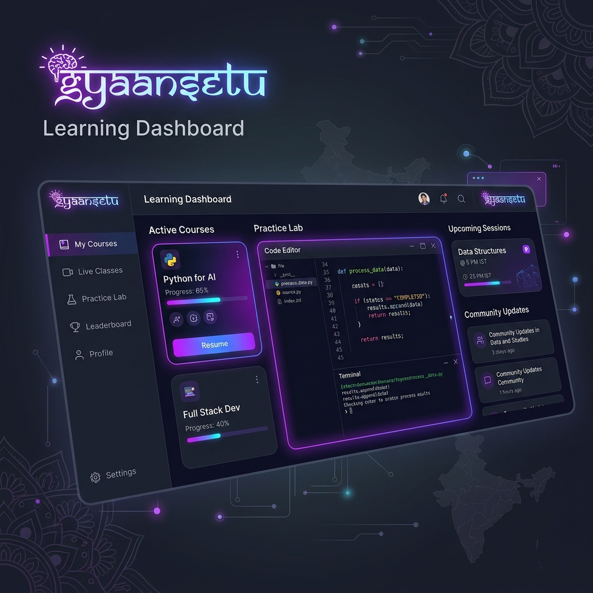

# 🌉 GyaanSetu (ज्ञानसेतु) — The Digital Courtyard

**GyaanSetu** is a premium, production-ready EdTech platform designed for the modern Indian learner. It bridges the gap between theory and industry by providing technical education in regional languages (Hindi, Gujarati, and English) integrated with cloud-based hands-on labs, real-time progress tracking, and professional content management.

---

## 📌 Important Links
* **Live Deployed Project:** [https://gyaansetuu.vercel.app/](https://gyaansetuu.vercel.app/)
* **Backend Deployed API:** [https://gyaansetu-593c.onrender.com](https://gyaansetu-593c.onrender.com)
* **Postman Documentation:** [https://documenter.getpostman.com/view/50839208/2sBXqKoL8c](https://documenter.getpostman.com/view/50839208/2sBXqKoL8c)
* **Figma Design:** [View on Figma](https://www.figma.com/design/VJS8z63ENFBdYR7R6728i3/GyaanSetu?node-id=0-1&t=z29S6KUnC5jqRb88-1)
* **YouTube Demo:** [https://youtu.be/cfDD_ksm9BU](https://youtu.be/cfDD_ksm9BU)

---

## 📸 Project Screenshots


*More screenshots can be added here*

---

## 🎯 Problem Statement
1. **Language Barrier**: Most high-quality technical education is exclusively in English, creating a hurdle for learners more comfortable in regional languages.
2. **Theoretical Gap**: Traditional platforms often focus on videos and quizzes, lacking hands-on environments where students can practice what they learn.
3. **Industry Irrelevance**: A disconnect exists between academic curriculum and the skills actually required by modern tech industries.

## 💡 Solution
- **Regional Localization**: Offers content in **Hindi, Gujarati, and English**, ensuring inclusivity.
- **Hands-on Learning**: Integrates browser-based **Labs and Project Workspaces** to enable "Learning by Doing."
- **LMS Excellence**: A full Learning Management System with granular progress tracking, lesson resumes, and a professional CMS for administrators.
- **Social Learning**: Real-time broadcasts of student achievements to foster a sense of community and motivation.

---

## 🚀 Key Features

- **🌍 Multi-Language Support**: Complete content localization in **Hindi**, **Gujarati**, and **English**.
- **🎓 Learning Management System (LMS)**: Persistent course enrollment with lesson-by-lesson progress tracking and "Resume Learning" capabilities.
- **⚡ Real-Time Social Proof**: Live notifications powered by **Socket.io** broadcast student achievements and enrollments globally.
- **🧪 Hands-on Labs**: Integrated, browser-based coding environments for "Learning by Doing."
- **🛡️ Advanced Security**: Robust authentication flow with JWT, protected routes, and secure **Forgot/Reset Password** via email tokens.
- **⚙️ Admin CMS**: Professional dashboard for full CRUD control over courses, curriculum modules, and user role management.
- **🖼️ Asset Management**: High-performance image and avatar uploads powered by **Cloudinary**.
- **✨ Premium UI/UX**: Built with the "Radiant Scholar" design system using Tailwind CSS and a curated color palette.

---

## 🛠️ Technology Stack

### Backend (The Brain)
- **Node.js & Express**: High-performance API architecture.
- **MongoDB & Mongoose**: Flexible document storage with virtuals and automated schema transforms.
- **Socket.io**: Real-time bidirectional event communication.
- **Multer & Cloudinary**: Secure multi-part file uploads and cloud asset optimization.
- **Nodemailer**: Automated transactional email system for authentication flows.

### Frontend (The Interface)
- **React 18 + Vite**: Lightning-fast development and optimized production builds.
- **TanStack Query (React Query)**: Enterprise-grade server state management and caching.
- **React Router v6**: Dynamic, lazy-loaded routing with robust guards.
- **Sonner & Toaster**: Modern, responsive feedback systems for user interactions.

### Infrastructure & DevOps
- **Docker & Docker Compose**: Containerized architecture for guaranteed consistency between dev and production.
- **Nginx**: High-performance web server for static asset serving in production.

---

## 📁 Project Structure

```bash
GyaanSetu/
├── Backend/            # Node.js API Service
│   ├── config/         # DB & Cloudinary configurations
│   ├── controllers/    # Business logic (Auth, Courses, Enrollments, Admin)
│   ├── models/         # Mongoose Schemas (User, Course, Enrollment, etc.)
│   ├── routes/         # Express API Endpoints
│   └── middleware/     # Auth & Role-based access control
├── Frontend/           # React Client Application
│   ├── src/
│   │   ├── components/ # Reusable UI Components
│   │   ├── contexts/   # Global State (Auth, Socket, Theme, Language)
│   │   ├── pages/      # View components (Lazy loaded)
│   │   ├── services/   # API Client & Socket service layers
│   │   └── lib/        # Shared utilities
└── README.md
```

---

## ⚙️ Getting Started

### Prerequisites
- **Node.js** (v18+)
- **MongoDB** (Local or Atlas)
- **Cloudinary Account** (For file uploads)

### Installation & Setup

1. **Clone and Install**:
   ```bash
   git clone https://github.com/DhruvOzha85/GyaanSetu.git
   cd GyaanSetu
   # Install Backend deps
   cd Backend && npm install
   # Install Frontend deps
   cd ../Frontend && npm install
   ```

2. **Backend Configuration**:
   Create `Backend/.env`:
   ```env
   PORT=5005
   MONGO_URI=mongodb://localhost:27017/GyaanSetu
   JWT_SECRET=your_super_secret_key
   CLOUDINARY_CLOUD_NAME=your_name
   CLOUDINARY_API_KEY=your_key
   CLOUDINARY_API_SECRET=your_secret
   # For Email (Optional: defaults to terminal log if empty)
   EMAIL_USER=your_email@gmail.com
   EMAIL_PASS=your_app_password
   ```

3. **Frontend Configuration**:
   Create `Frontend/.env`:
   ```env
   VITE_API_BASE_URL=http://localhost:5005/api
   VITE_USE_REAL_API=true
   ```

4. **Launch Application**:
   ```bash
   # Terminal 1: Backend
   cd Backend && npm run dev
   # Terminal 2: Frontend
   cd Frontend && npm run dev
   ```

---

## 🚀 Deployment Guide

### 🟢 Backend (Render)
1. **Create Web Service**: Connect your GitHub repo.
2. **Root Directory**: `Backend`
3. **Build Command**: `npm install`
4. **Start Command**: `node server.js`
5. **Environment Variables**: Add all variables from `Backend/.env` (especially `MONGO_URI` and `JWT_SECRET`).

### 🔵 Frontend (Vercel)
1. **Import Project**: Select the repo.
2. **Framework Preset**: `Vite`
3. **Root Directory**: `Frontend`
4. **Build Command**: `npm run build`
5. **Output Directory**: `dist`
6. **Environment Variables**: 
   - `VITE_API_BASE_URL`: The URL of your Render backend (e.g., `https://gyaansetu-api.onrender.com/api`)
   - `VITE_USE_REAL_API`: `true`

---

## 🐳 Docker Deployment

For a production-ready setup:
```bash
# Build and start all services
docker-compose up --build
```

---

## 👤 Author

**Dhruv Ojha**
*Full-Stack Developer & Product Designer*

- [GitHub](https://github.com/DhruvOzha85)
- [Portfolio](https://dhruvozha.in)

---
*Built with ❤️ to bridge the education gap in India.*